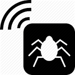

# Wirespy

## Automate Man In The Middle Attacks (MITMAs) over WiFi.
Wirespy allows attackers to set up quick honeypots to carry out MITMAs. Monitoring and logging functionalities are implemented in order to keep records of the victims traffics/activities. Other tools can be used together with Wirespy to further more advanced attacks. 

Two type of attacks are supported at the moment:
* **Honeypot:** set up a simple rogue hotspot and wait for clients to connect.
* **Evil-twin:** force victims to auto-connect to the honeyspot by spoofing a *"trusted"* hotspot.

## Features
* Power amplification.
* MAC address spoofing.
* Rogue access-point.
* Evil-twin attack: 
	* Clone an access-point. 
	* De-authenticate its users to force them to transparently auto-connect  
	  to the evil-twin (spoofed) access-point.
* Monitoring the victims' traffics.
* Logging the victims' traffics.

## Usage
1. Make the script executable:
		
		$ chmod +x wirespy.sh

2. Run the script as root:

		$ sudo ./wirespy.sh

## Dependencies
Works out of the box using Kali Linux.

## Future Improvements
- [ ] Add new features.
- [ ] Debugging.
- [ ] Source code optimisations.

## Project Information
This script was developed in the context of my master thesis work in June 2015.

## License
   Copyright (C) 2015 Alexandre Teyar

Licensed under the Apache License, Version 2.0 (the "License");
you may not use this file except in compliance with the License.
You may obtain a copy of the License at

<http://www.apache.org/licenses/LICENSE-2.0>

Unless required by applicable law or agreed to in writing, software
distributed under the License is distributed on an "AS IS" BASIS,
WITHOUT WARRANTIES OR CONDITIONS OF ANY KIND, either express or implied.
See the License for the specific language governing permissions and
   limitations under the License. 
